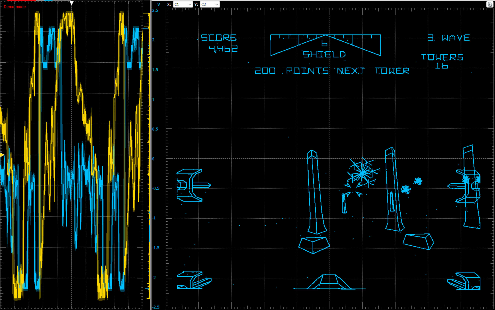

# vector_pico
A vector graphics generator for the RP2040 (Raspberry Pi Pico)

This is a system that creates vector graphics using two DACs - one for the X axis, and one for the Y axis. The $4 Raspberry Pi Pico microcontroller is used to generate the vectors and drive the DACs. With this system, it's possible to play games such as Asteroids and Tempest on an oscilloscope, vectorscope, or vector monitor.

